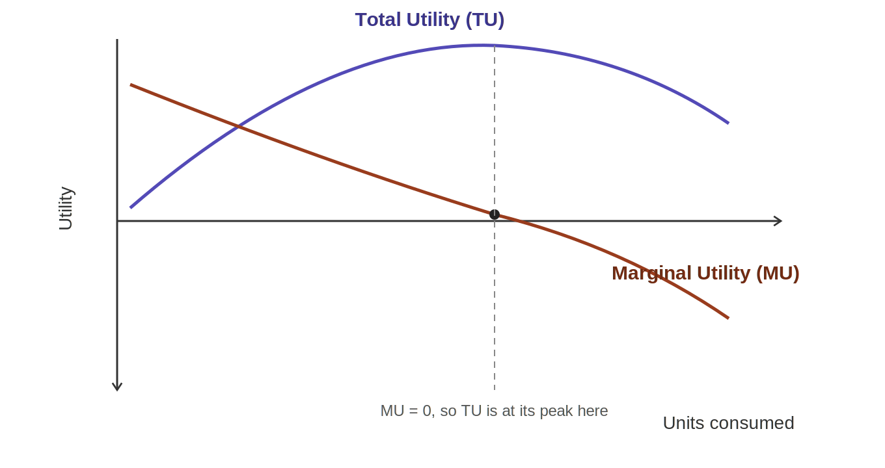
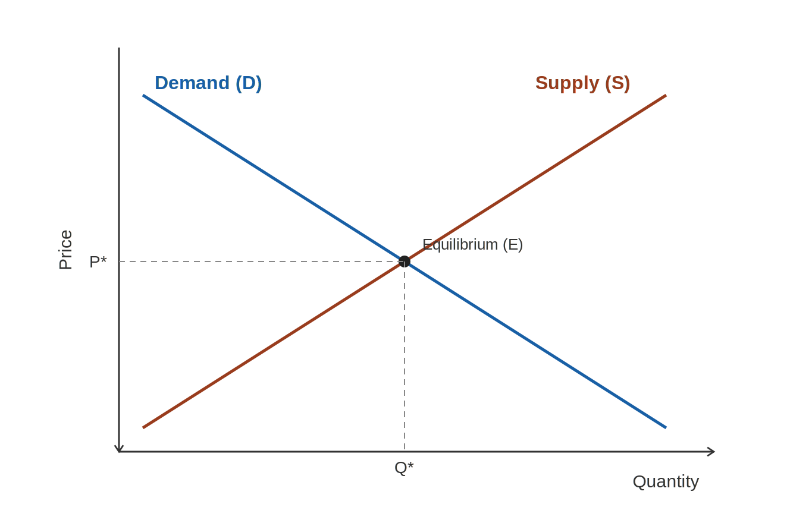
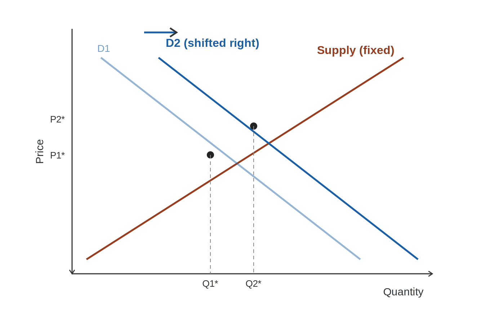
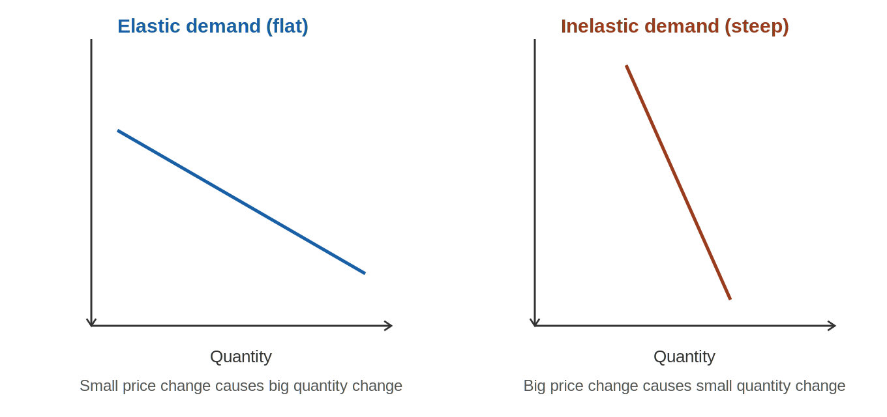
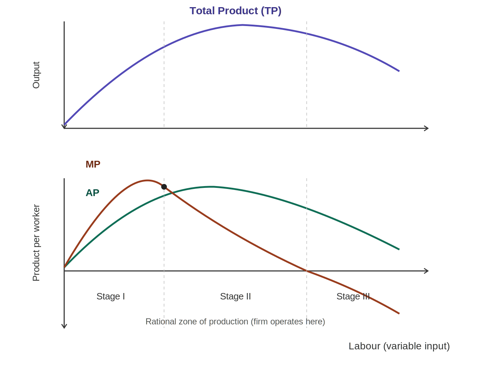

# Managerial Economics — Notes for Sessions 1–8 (Midterm Syllabus)
*Goa Institute of Management | PGDM-BDA | Based on Pindyck & Rubinfeld, "Microeconomics" (9th Ed.)*

---

# SESSION 1: Introduction — The Content of Economics

## 1.1 What is Economics?

**Economics** is the study of how individuals, firms, and societies choose to use **scarce resources** to satisfy **unlimited wants**. At its heart, economics is the study of **choice under scarcity**.

Managerial Economics specifically applies microeconomic tools (theory of the consumer, the firm, markets) to real **business decision-making** — pricing, production, investment, and competitive strategy.

## 1.2 The Fundamental Economic Problem: Scarcity

**Scarcity** means resources (land, labour, capital, raw materials, time) are limited relative to the unlimited wants of people and businesses. Because resources are scarce, every choice involves a **trade-off** — choosing one thing means giving up something else.

> **Example:** A company has ₹10 crore to invest. It can build a new factory OR invest in R&D — not both fully. Choosing the factory means giving up (some of) the R&D opportunity. That foregone opportunity is the essence of scarcity-driven choice.

## 1.3 Implications of Scarcity

Because of scarcity, every economic system/business must answer three questions:
1. **What** to produce (and how much)?
2. **How** to produce it (what combination of labour, capital, technology)?
3. **For whom** to produce (who gets the output)?

This leads directly to the concept of **Opportunity Cost** — the value of the next-best alternative given up when a choice is made.

> **Example:** If you spend a Saturday studying for your midterm instead of working a part-time job that pays ₹2,000, the opportunity cost of studying is ₹2,000 (the foregone earnings) — not the "zero" cost you might assume since no cash left your pocket.

## 1.4 Types of Economy

| Type | Who decides "what/how/for whom"? |
|---|---|
| **Market Economy** | Prices, driven by supply & demand in free markets, allocate resources (e.g., USA) |
| **Command/Planned Economy** | Central government decides allocation (e.g., former USSR) |
| **Mixed Economy** | Combination — markets operate, but government intervenes (most real-world economies, including India) |

## 1.5 Microeconomics vs. Macroeconomics

| | Microeconomics | Macroeconomics |
|---|---|---|
| **Focus** | Individual units — consumers, firms, specific markets | The economy as a whole — aggregates |
| **Typical questions** | Why does a firm price its product a certain way? How does a consumer choose between two goods? | What determines national GDP, inflation, unemployment? |
| **Managerial Economics uses** | Primarily microeconomics — it's about *decisions within a firm/market* | Some macro context (e.g., interest rates affecting investment decisions) |

### Quick FAQ — Session 1
**Q: Is "opportunity cost" the same as "money spent"?**
No. Opportunity cost is the value of the *best forgone alternative*, which may or may not equal actual cash spent. Even "free" choices (like spending your own time) have an opportunity cost.

**Q: Why does managerial economics rely mostly on microeconomics rather than macroeconomics?**
Because managerial decisions (pricing a product, choosing output levels, entering a market) are fundamentally about individual firm and market-level behavior — which is exactly what microeconomics studies. Macro factors (interest rates, inflation) matter too, but as background context rather than the core toolkit.

---

# SESSIONS 2 & 3: Theory of Consumer Behaviour

## 2.1 The Concept of Utility

**Utility** is the satisfaction or happiness a consumer derives from consuming a good or service. It's a way of representing consumer *preferences* numerically (even if utility itself isn't directly measurable in real life — it's a modeling tool).

- **Total Utility (TU):** The total satisfaction from consuming a given quantity of a good.
- **Marginal Utility (MU):** The *additional* satisfaction gained from consuming **one more unit** of a good.

$$MU = \frac{\Delta TU}{\Delta Q}$$

> **Example:** Eating your first slice of pizza when very hungry gives you huge satisfaction (high TU added). Eating a second slice adds satisfaction too, but usually less than the first. This "less-and-less extra satisfaction" pattern is the Law of Diminishing Marginal Utility.

## 2.2 Law of Diminishing Marginal Utility

> As a consumer consumes **more and more units** of a good (holding other goods constant), the **marginal utility** from each additional unit **eventually decreases**.

| Slices of Pizza | Total Utility | Marginal Utility |
|---|---|---|
| 1 | 20 | 20 |
| 2 | 36 | 16 |
| 3 | 46 | 10 |
| 4 | 50 | 4 |
| 5 | 48 | −2 |

Notice: Total Utility keeps rising until slice 4, but Marginal Utility keeps *falling* the whole time — and turns negative at slice 5 (eating that 5th slice actually makes you feel worse, e.g., overfull). This is why demand curves slope downward: you'll only buy an additional unit if its price is low enough to match the (falling) extra satisfaction it provides.

**Reading the TU/MU graph:** Plot Total Utility on top of Marginal Utility (same x-axis = units consumed). Two things to notice every time you see this graph:
1. **TU keeps rising as long as MU is positive** — even though the *rate* of rise slows down (that's what "diminishing" looks like: the TU curve flattening as you move right).
2. **TU peaks exactly at the unit where MU = 0**, and if you kept consuming beyond that, MU goes negative and TU starts *falling*. The MU curve literally tells you the *slope* of the TU curve at every point.

**Graph-based FAQ:** *If you're shown a TU/MU graph and asked "at which unit is total satisfaction maximized," how do you read it off?* Find where the MU curve crosses the horizontal axis (MU = 0) — the unit directly below that crossing point on the x-axis is where TU is at its peak. You never need to compute anything; just read the x-coordinate where MU hits zero.

## 2.3 Consumer's Equilibrium

A rational consumer with a limited budget wants to **maximize total utility**. The condition for consumer equilibrium (when spending across two goods X and Y) is:

$$\frac{MU_X}{P_X} = \frac{MU_Y}{P_Y}$$

This means: the **marginal utility per rupee spent** must be **equal across all goods** at equilibrium. If MU per rupee is higher for good X than good Y, the consumer should buy more X and less Y until the ratios equalize (because of diminishing marginal utility, buying more X lowers its MU, and buying less Y raises its MU, until they meet).

> **Example:** Suppose a chocolate (₹10) gives MU = 40, and a chips packet (₹20) gives MU = 60.
> - MU per rupee for chocolate = 40/10 = 4
> - MU per rupee for chips = 60/20 = 3
> Since chocolate gives more utility per rupee, the consumer should buy *more chocolate* and *less chips* — reallocating spending until the marginal utility per rupee is equal for both.

## 2.4 Consumer's Surplus

**Consumer Surplus** = the difference between what a consumer is **willing to pay** for a good and what they **actually pay** (the market price).

$$\text{Consumer Surplus} = \text{Willingness to Pay} - \text{Actual Price Paid}$$

Graphically, it's the area **below the demand curve and above the market price line**, up to the quantity purchased.

> **Example:** You're willing to pay ₹500 for a concert ticket, but it's sold for ₹350. Your consumer surplus = ₹500 − ₹350 = **₹150**. Across *all* buyers in a market, total consumer surplus reflects the total "value" society gets beyond what it pays — a key concept in judging market efficiency and welfare.

### Quick FAQ — Sessions 2 & 3
**Q: Why does Marginal Utility eventually turn negative, but Total Utility doesn't (until MU is negative)?**
As long as MU is positive, each new unit still *adds* to Total Utility (even if by a shrinking amount) — so TU keeps rising. Once MU turns negative, the additional unit actually *subtracts* from satisfaction (e.g., feeling sick from overeating), so TU starts falling.

**Q: If MU per rupee is unequal across goods, is the consumer at equilibrium?**
No — the consumer can increase total utility by reallocating spending toward the good with the higher MU per rupee, until the ratios equalize. Only when MU/P is equal across all goods is the consumer's utility maximized given their budget.

**Q: Does a higher price always mean lower consumer surplus?**
Yes, all else equal — as price rises toward a consumer's willingness to pay, the gap (surplus) shrinks. If price exceeds willingness to pay, the consumer simply won't buy, and surplus becomes zero (not negative) for that consumer.

---

# SESSION 4: Demand and Supply — The Elementary Theory of Allocation

## 4.1 Demand

**Demand** is the quantity of a good a consumer is **willing and able** to buy at a given price, over a given period.

**Law of Demand:** As price **increases**, quantity demanded **decreases** (all else equal) — giving the demand curve its typical **downward slope**.

$$Q_d = f(P) \quad \text{(inverse relationship, ceteris paribus)}$$

**Determinants of demand (shift the whole curve, not just movement along it):**
- Price of the good itself → causes **movement along** the demand curve
- Income of consumers (Normal goods: demand ↑ as income ↑; Inferior goods: demand ↓ as income ↑)
- Prices of related goods (Substitutes: e.g., tea & coffee; Complements: e.g., cars & petrol)
- Tastes and preferences
- Consumer expectations (e.g., expecting a price hike next month → buy more now)
- Number of buyers in the market

> **Example:** If the price of Pepsi rises, people buy less Pepsi (movement along Pepsi's demand curve) but may buy *more* Coke (a substitute) — shifting Coke's *entire* demand curve rightward.

**The Demand Curve, graphically:** Price is on the vertical axis, Quantity on the horizontal axis. The curve slopes **downward left-to-right** — this single visual is the Law of Demand. A **movement along** this fixed curve happens only when the good's *own* price changes. A **shift of the entire curve** (left or right) happens when any *other* determinant changes (income, tastes, price of related goods, etc.) — this is one of the most common graph-reading mistakes students make, so always ask "did the price of *this good* change, or did something *else* change?" before deciding whether to move along the curve or redraw it.

## 4.2 Supply

**Supply** is the quantity of a good producers are **willing and able** to sell at a given price, over a given period.

**Law of Supply:** As price **increases**, quantity supplied **increases** (all else equal) — giving the supply curve its typical **upward slope**, since higher prices make production more profitable.

**Determinants of supply (shift the curve):**
- Price of the good → movement along the supply curve
- Cost of inputs/production (raw materials, wages) — higher cost shifts supply **left**
- Technology — improved technology shifts supply **right**
- Number of sellers
- Government policy (taxes, subsidies)
- Producer expectations

## 4.3 Market Equilibrium

**Equilibrium** occurs where Quantity Demanded = Quantity Supplied — the market "clears" at the **equilibrium price (P\*)** and **equilibrium quantity (Q\*)**.

- If Price > P\*: Quantity Supplied > Quantity Demanded → **Surplus** → sellers cut prices → price falls back to P\*
- If Price < P\*: Quantity Demanded > Quantity Supplied → **Shortage** → buyers bid prices up → price rises back to P\*

> **Example:** If the equilibrium price of onions is ₹30/kg but the government sets a price ceiling of ₹20/kg, quantity demanded will exceed quantity supplied at ₹20 → a **shortage** results (this is why price controls often lead to scarcity/black markets).

**Reading the Demand-Supply graph:** Draw D sloping down and S sloping up — their intersection point is **E (equilibrium)**, with coordinates (Q\*, P\*) directly readable off the two axes. To find a surplus or shortage at any *other* price, draw a horizontal line at that price and read off the two different quantities where it crosses D and S — the *gap* between those two quantities (measured horizontally) is the size of the surplus or shortage.

**Shifting the graph:** When a determinant of demand changes (say, incomes rise), redraw the *entire* D curve shifted rightward (parallel shift), keeping S fixed — the new intersection point (E₂) will generally show **both a higher P\* and a higher Q\*** if demand shifts right (as we saw in the Session 4 demand-shift diagram above). If instead *supply* shifts (say, a cost increase shifts S left), P\* rises but Q\* falls — the *opposite* pattern. Always keep track of which curve is actually moving, because that determines whether price and quantity move in the *same* direction (as with a demand shift) or *opposite* directions (as with a supply shift).

### Quick FAQ — Session 4
**Q: What's the difference between "change in demand" and "change in quantity demanded"?**
"Change in quantity demanded" = movement *along* a fixed demand curve, caused only by a change in the good's own price. "Change in demand" = the entire curve *shifts*, caused by a change in a non-price determinant (income, tastes, price of related goods, etc.).

**Q: If both demand and supply increase simultaneously, what happens to equilibrium quantity and price?**
Quantity definitely rises (both curves push quantity up). Price is *ambiguous* — it depends on the relative size of the shifts. If demand increases more than supply, price rises; if supply increases more than demand, price falls.

**Q: Why does a shortage created by a price ceiling not "fix itself"?**
Because the price is *legally capped* below equilibrium — sellers can't raise the price to ration the excess demand, so the shortage persists as long as the ceiling remains binding (below P*).

---

# SESSIONS 5 & 6: Elasticity and Market Failure

## 5.1 Why Elasticity Matters

The Law of Demand tells us direction (price ↑ → quantity ↓), but not **magnitude**. **Elasticity** measures *how responsive* quantity is to a change in price (or income, or the price of another good) — critical for pricing decisions.

## 5.2 Price Elasticity of Demand (PED)

$$PED = \frac{\%\ \Delta \text{Quantity Demanded}}{\%\ \Delta \text{Price}}$$

Since demand curves slope downward, PED is technically negative, but is usually discussed in **absolute value** terms.

| |PED| | Classification | Meaning |
|---|---|---|
| > 1 | **Elastic** | Quantity changes proportionally *more* than price (e.g., luxury goods, goods with many substitutes) |
| < 1 | **Inelastic** | Quantity changes proportionally *less* than price (e.g., necessities, goods with few substitutes) |
| = 1 | **Unit elastic** | Quantity changes exactly proportionally to price |
| = 0 | **Perfectly Inelastic** | Quantity doesn't change at all regardless of price (e.g., life-saving insulin for a diabetic) |
| = ∞ | **Perfectly Elastic** | Any price increase causes quantity demanded to fall to zero |

**Worked Example:** If the price of a chocolate bar rises from ₹10 to ₹12 (a 20% increase) and quantity demanded falls from 100 to 70 units (a 30% decrease):
$$PED = \frac{-30\%}{20\%} = -1.5 \Rightarrow |PED| = 1.5 \text{ (Elastic)}$$

**Business implication:** If demand is elastic, **raising price will reduce total revenue** (because the % drop in quantity outweighs the % rise in price). If demand is inelastic, raising price **increases total revenue** (quantity falls proportionally less).

$$\text{Total Revenue} = P \times Q$$

**Factors affecting PED:**
- Availability of substitutes (more substitutes → more elastic)
- Necessity vs. luxury (necessities are more inelastic)
- Proportion of income spent on the good (higher proportion → more elastic)
- Time horizon (demand tends to become more elastic over longer time periods, as consumers find substitutes)

**Reading elasticity off a graph (the visual shortcut):** You can often judge elasticity *by eye*, without computing a single number — just look at the **steepness/flatness** of the demand curve:
- A **flatter (closer to horizontal)** demand curve = **elastic** — a small price change causes a large swing in quantity.
- A **steeper (closer to vertical)** demand curve = **inelastic** — even a big price change barely moves quantity.
- A perfectly **vertical** line = perfectly inelastic (PED = 0); a perfectly **horizontal** line = perfectly elastic (PED = ∞).

*Caution:* Strictly, PED also depends on *where* you are on a given (straight-line) demand curve — the same straight-line curve is more elastic near the top (high price, low quantity) and more inelastic near the bottom (low price, high quantity), even though its slope never changes! So "flat vs steep" is a good way to compare *two different* curves, but along a *single* straight-line curve, elasticity itself changes as you slide along it.

## 5.3 Income Elasticity of Demand (YED)

$$YED = \frac{\%\ \Delta \text{Quantity Demanded}}{\%\ \Delta \text{Income}}$$

| YED value | Good type | Example |
|---|---|---|
| YED > 0 | **Normal Good** | demand rises as income rises (e.g., branded clothing) |
| YED < 0 | **Inferior Good** | demand falls as income rises (e.g., bus travel, as people switch to cars when richer) |
| YED > 1 | **Luxury/Superior Good** | demand rises *more than proportionally* with income (e.g., foreign vacations) |
| 0 < YED < 1 | **Necessity** | demand rises, but less than proportionally with income (e.g., basic groceries) |

## 5.4 Cross-Elasticity of Demand (CED)

$$CED = \frac{\%\ \Delta \text{Quantity Demanded of Good A}}{\%\ \Delta \text{Price of Good B}}$$

| CED value | Relationship | Example |
|---|---|---|
| CED > 0 | **Substitutes** | if tea's price rises, demand for coffee rises |
| CED < 0 | **Complements** | if petrol's price rises, demand for cars falls |
| CED ≈ 0 | **Unrelated goods** | if rice's price rises, demand for shoes is unaffected |

## 5.5 Price Elasticity of Supply (PES)

$$PES = \frac{\%\ \Delta \text{Quantity Supplied}}{\%\ \Delta \text{Price}}$$

Supply tends to be more elastic when: production can be scaled up quickly, inputs are readily available, and there's spare production capacity. Supply tends to be inelastic for goods that take time to produce (e.g., agricultural crops in the short run — you can't grow more wheat overnight, no matter the price).

## 5.6 Market Failure and Government Intervention

**Market Failure** occurs when the free market, left alone, fails to allocate resources efficiently — meaning total surplus (consumer + producer surplus) is not maximized. Common causes:

- **Externalities:** Costs or benefits affecting third parties not involved in the transaction.
  - *Negative externality:* Factory pollution harms nearby residents who aren't part of the buyer-seller transaction → market tends to **overproduce** the polluting good, since private cost < social cost.
  - *Positive externality:* Education benefits society beyond the individual (better citizens, lower crime) → market tends to **underproduce**, since private benefit < social benefit.
- **Public Goods:** Non-excludable and non-rivalrous goods (e.g., national defense, street lighting) — the private market tends to underprovide them because people can "free-ride" without paying.
- **Market Power/Monopoly:** A single dominant seller restricts output and raises price above the competitive level, reducing total surplus (this is covered further in Session 11).
- **Information Asymmetry:** One party in a transaction has more/better information than the other (e.g., used-car sellers know more about a car's condition than buyers).

**Government interventions** to correct market failure: taxes (e.g., carbon tax on pollution), subsidies (e.g., for education/vaccines), regulation (emission standards), and direct provision of public goods.

### Quick FAQ — Sessions 5 & 6
**Q: If a company wants to increase total revenue by raising price, what should it check first?**
Whether demand for its product is elastic or inelastic. If demand is **inelastic** (|PED| < 1), raising price increases total revenue. If demand is **elastic** (|PED| > 1), raising price actually *reduces* total revenue — the firm should consider *lowering* price instead to boost revenue.

**Q: Why is short-run supply for agricultural goods often more inelastic than for manufactured goods?**
Because crops take a fixed growing season to produce — farmers can't instantly respond to a price spike by producing more (unlike a factory that might ramp up shifts). Over the long run, however, farmers can expand acreage, making supply more elastic.

**Q: Give an example of a negative externality and how a government might correct it.**
A factory emitting smoke harms nearby residents (health costs) who aren't compensated in the factory's transactions. Government can impose a **pollution tax** equal to the external cost, forcing the factory to "internalize" the externality — raising its private cost closer to the true social cost and reducing overproduction.

**Q: Is a Giffen good the same as an inferior good?**
All Giffen goods are inferior goods, but not all inferior goods are Giffen goods. A Giffen good is a rare, extreme case where quantity demanded actually *rises* as price rises (violating the Law of Demand) — this happens only under specific conditions (very poor consumers, a staple good with no close substitute, where the income effect of a price change dominates the substitution effect).

---

# SESSION 7: Theory of Production — The Production Function

## 7.1 What is a Production Function?

A **Production Function** shows the maximum output (Q) a firm can produce from a given combination of inputs (typically Labour L and Capital K), given the current state of technology:

$$Q = f(L, K)$$

It's a purely *technical* relationship — describing what's physically possible, not what's profitable (that comes later, once we bring in costs and prices).

## 7.2 Short-Run vs. Long-Run Production Functions

| | Short Run | Long Run |
|---|---|---|
| **Definition** | At least one input is **fixed** (typically Capital) | **All** inputs are **variable** |
| **What can the firm change?** | Only the variable input (e.g., Labour) | Every input, including plant size/technology |
| **Key question** | How does output change as we add more of the variable input to a fixed input? | What's the best *combination* of inputs to use, and at what scale? |

> **Example:** A restaurant with one kitchen (fixed capital) can hire more chefs (variable labour) in the short run to increase output — but it can only expand up to the point where the kitchen becomes a bottleneck. In the long run, the restaurant could build a bigger kitchen or open a second location — every input becomes adjustable.

### Quick FAQ — Session 7
**Q: Is "short run" a fixed period of calendar time, like exactly one year?**
No — "short run" and "long run" are defined by whether inputs can be varied, not by calendar time. For a small business, the "long run" might be a few months (easy to add new equipment); for a power plant, the "long run" might be several years (major infrastructure takes time to build).

**Q: Can a firm have zero fixed inputs in the short run?**
No — by definition, the short run requires *at least one* fixed input. If ALL inputs are variable, we are, by definition, in the long run.

---

# SESSION 8: Zones of Production — Total, Average, and Marginal Product

## 8.1 Total Product (TP), Average Product (AP), Marginal Product (MP)

Consider a firm using a fixed amount of Capital (K) and varying only Labour (L) in the short run:

- **Total Product (TP):** Total output produced by a given quantity of the variable input.
- **Average Product (AP):** Output per unit of the variable input.
$$AP_L = \frac{TP}{L}$$
- **Marginal Product (MP):** The *additional* output from employing **one more unit** of the variable input.
$$MP_L = \frac{\Delta TP}{\Delta L}$$

**Worked Example:**

| Labour (L) | Total Product (TP) | Marginal Product (MP) | Average Product (AP) |
|---|---|---|---|
| 0 | 0 | — | — |
| 1 | 10 | 10 | 10.0 |
| 2 | 22 | 12 | 11.0 |
| 3 | 33 | 11 | 11.0 |
| 4 | 40 | 7 | 10.0 |
| 5 | 44 | 4 | 8.8 |
| 6 | 44 | 0 | 7.3 |
| 7 | 40 | −4 | 5.7 |

## 8.2 The Law of Diminishing (Marginal) Returns

> As successive units of a variable input (e.g., Labour) are added to a fixed input (e.g., Capital), **beyond some point**, the **marginal product** of the variable input **will decline**.

*Why?* Initially, adding workers to a fixed factory lets them specialize and use the fixed capital more effectively (MP rises — this is called **increasing returns**). But eventually, the fixed capital becomes a bottleneck — too many workers are crowding around too few machines, so each additional worker adds less and less extra output (MP falls — **diminishing returns**). Eventually, adding even more workers can make MP **negative** (workers get in each other's way, and total output actually falls).

> **Example:** In the table above, MP rises from 10 → 12 (workers 1→2, increasing returns), then falls 12 → 11 → 7 → 4 → 0 → −4 (diminishing and eventually negative returns) as more and more workers are added to the same fixed kitchen/factory.

## 8.3 Relationship between TP, AP, and MP

This is one of the most commonly tested concepts — memorize these three rules:

1. **When MP > AP, AP is rising.** (Adding a worker whose productivity is above the current average pulls the average up.)
2. **When MP < AP, AP is falling.** (Adding a below-average worker pulls the average down.)
3. **MP = AP at the point where AP is at its maximum** (MP curve cuts the AP curve exactly at AP's peak — same logic as in any "marginal pulls the average" relationship, e.g., your latest exam score vs. your GPA average).

Also:
- **TP is maximized when MP = 0.** (As long as MP is positive, TP keeps rising; once MP turns negative, TP starts falling; so TP peaks exactly when MP crosses zero.)
- **TP rises at an increasing rate while MP is rising**, and **TP rises at a decreasing rate once MP starts falling** (but is still positive) — this is the inflection point marking the onset of diminishing returns.

> **Analogy:** Think of AP as your "cricket batting average" and MP as "runs scored in today's match." If today's runs (MP) are higher than your career average (AP), your average goes up. If today's runs are lower than your average, your average goes down. Your average is at its peak exactly on the day your current-match score equals your average — after that, if you keep having below-average days, your average starts declining.

## 8.3a Reading the TP/AP/MP Graph

This topic is almost *always* tested using a graph, so it's worth learning to read it directly rather than only from the table. Picture **two stacked panels** sharing the same horizontal axis (units of Labour):
- **Top panel:** The TP curve — rises steeply at first, keeps rising but more slowly, reaches a peak, then turns down.
- **Bottom panel:** The AP and MP curves — both start by rising, then fall. Critically, **MP rises above AP, crosses through AP's peak, and then dips below AP** and eventually crosses the horizontal axis into negative territory.

**Three things to verify on any TP/AP/MP graph:**
1. Directly below the point where the **MP curve crosses the AP curve**, the **AP curve is at its own maximum** (this is where MP = AP).
2. Directly below the point where the **MP curve crosses the horizontal axis (MP = 0)**, the **TP curve is at its own maximum** (peak of TP).
3. The three "stages" (Stage I / II / III) are simply the sections of the x-axis carved out by these two crossing points — Stage I ends where AP peaks, Stage II ends where MP hits zero (TP peaks), and Stage III is everything beyond that.

## 8.4 The Three Zones (Stages) of Production

| Zone | Behaviour | Rational for firm? |
|---|---|---|
| **Stage I** (Increasing returns to the variable input) | MP > AP, AP still rising; TP rising at increasing then decreasing rate | **No** — firm is under-utilizing its fixed capital; should add more labour, since each new worker adds more than the average |
| **Stage II** (Diminishing returns) | MP < AP but MP > 0; AP falling but still positive; TP still rising (at decreasing rate) | **Yes** — this is the economically rational zone of production; firm operates here |
| **Stage III** (Negative returns) | MP < 0; TP falling | **No** — adding more labour actually reduces total output; firm should never operate here |

**Optimal production zone = Stage II.** Stage I is irrational because the firm hasn't yet exploited all the gains from adding labour to its fixed capital (it's "wasting" capital capacity). Stage III is irrational because the variable input has become actively counterproductive. Rational firms always choose to operate somewhere within Stage II, with the *exact* point within Stage II determined later by cost and price considerations (marginal analysis) — a topic in the following sessions (9 onward, thus not on this midterm).

### Quick FAQ — Session 8
**Q: If MP is positive but falling, is Total Product rising or falling?**
Still **rising** — as long as MP stays positive (even if it's declining), each additional worker still adds *something* to output, so TP keeps increasing (just at a slower and slower rate). TP only starts to *fall* once MP turns negative.

**Q: Why does the MP curve cross the AP curve exactly at AP's maximum point, and not before or after?**
This is a mathematical/logical necessity of how averages work: whenever the incoming ("marginal") value is above the running average, it pulls the average up; whenever it's below, it pulls the average down. The average can only be at a peak (turning from rising to falling) at the exact instant the marginal value equals the average — any other point would mean the average is still moving in one direction.

**Q: Why would a firm never choose to operate in Stage I even though output (TP) is still rising there?**
Because in Stage I, the fixed capital is being under-utilized relative to labour — each additional worker's marginal product is *above* the average product, meaning the firm could get even more efficient (higher average output per worker) simply by adding more labour, at no extra cost of underused capacity. It's not that output would fall — it's that the firm isn't yet using its resources as efficiently as it easily could by hiring more workers.

**Q: Why is Stage III always irrational, no matter how cheap labour is?**
Because MP is *negative* there — adding more labour actually **reduces** total output. Even if labour is free, no rational firm would hire workers who make total production go down; the firm would rather send them home (zero labour cost is still worse than negative output).

**Q: What causes the Law of Diminishing Returns to set in?**
It results from combining more and more of a variable input with a *fixed* quantity of another input (like capital, land, or machinery). Since the fixed input can't expand to match the growing variable input, each additional unit of the variable input eventually has less of the fixed input to work with, causing its marginal contribution to shrink.

---

# GRAPH-BASED FAQs (very likely exam style)

**Q1. On a standard demand-supply diagram, the government imposes a price floor *above* equilibrium price. What do you see on the graph, and what's the economic result?**
Draw a horizontal line above the equilibrium point E — where this line crosses S gives a large quantity supplied, and where it crosses D gives a small quantity demanded. The horizontal *gap* between these two crossing points (Qs > Qd) is a **surplus** (excess supply) — visually, the supply curve is "further right" than the demand curve at that price. (Classic real example: minimum wage laws, or agricultural price supports.)

**Q2. Two demand curves are drawn for the same product: one very flat, one very steep. Which curve belongs to a necessity like insulin, and which to a luxury like designer handbags?**
The **steep (near-vertical)** curve is insulin — quantity demanded barely changes even with big price swings (perfectly inelastic in the extreme, since patients need it regardless of price). The **flat (near-horizontal)** curve is designer handbags — a small price change causes a large swing in quantity demanded, since buyers can easily switch to other luxury brands or simply not buy at all.

**Q3. On a TP/AP/MP graph, you're told the firm is currently producing at a labour level where the MP curve is below the AP curve but still above zero. Which stage is the firm in, and should it hire more or fewer workers?**
This is **Stage II** (MP positive but below AP — meaning AP is declining, but TP is still rising). This is the *rational* zone, so the firm doesn't need to change stages — but the exact optimal point *within* Stage II depends on wage rates and output price (a cost-benefit comparison covered in later sessions, beyond the midterm scope). The key graph-reading point: as long as you're between "MP=AP" (Stage I/II boundary) and "MP=0" (Stage II/III boundary), you're in the safe, rational zone.

**Q4. A student draws a demand curve as a straight line and claims "elasticity is constant along a straight-line demand curve since the slope never changes." Is this correct? Use the graph to explain.**
No. While the **slope** (the physical steepness, ΔP/ΔQ) of a straight line is indeed constant everywhere, **elasticity** (a %-based measure) is *not* the same as slope. Near the top-left of the curve (high price, low quantity), the *percentage* change in quantity for a given absolute price change is large relative to the small base quantity — making demand elastic there. Near the bottom-right (low price, high quantity), the same absolute price change is a *large* percentage change relative to a low base price, but a *small* percentage change in the now-large quantity — making demand inelastic there. So even a straight-line demand curve is elastic at the top and inelastic at the bottom, with unit elasticity exactly at its midpoint.

**Q5. On the Total Utility / Marginal Utility graph, a consumer is told they're "past the point where MU = 0." What does the TU curve look like at that point, and should they consume more?**
Past MU = 0, marginal utility is **negative**, meaning the TU curve has turned downward (past its peak) — each additional unit is now *reducing* total satisfaction. The consumer should **not** consume more of that good; they've already overshot the point of maximum total utility.

**Q6. If a rightward shift of the demand curve is drawn alongside a completely stationary supply curve, what happens to equilibrium price and quantity — and how would the graph look different if it were the supply curve shifting right instead?**
**Demand shifts right, supply fixed:** New equilibrium has *both* higher price and higher quantity (visually, the new intersection point is up and to the right of the old one, since the fixed upward-sloping S curve is being intersected further along its own upward path).
**Supply shifts right, demand fixed:** New equilibrium has *lower* price but *higher* quantity (visually, the new intersection point is down and to the right — because now it's the downward-sloping D curve being intersected further along its own downward path). This is why it's crucial to identify *which* curve moved before predicting what happens to price.

---

# CONSOLIDATED MIDTERM QUICK-REVIEW FAQs

**Q1. What's the difference between economics and managerial economics?**
Economics broadly studies the allocation of scarce resources across society; managerial economics applies the *microeconomic* subset of that theory specifically to firm-level decision-making (pricing, production, market strategy).

**Q2. State the Law of Diminishing Marginal Utility in one line.**
As a consumer consumes successive units of a good, the additional (marginal) satisfaction from each extra unit eventually declines.

**Q3. What is the condition for Consumer Equilibrium across two goods?**
MUx/Px = MUy/Py — marginal utility per rupee spent must be equal across all goods purchased.

**Q4. Distinguish "change in demand" from "change in quantity demanded."**
Change in quantity demanded = movement along a fixed curve (caused only by the good's own price change). Change in demand = the entire curve shifts (caused by income, tastes, related goods' prices, etc.)

**Q5. If |PED| = 0.5, is demand elastic or inelastic — and what happens to total revenue if price rises?**
Inelastic (|PED| < 1). If price rises, total revenue **increases**, because quantity falls proportionally less than price rises.

**Q6. What does a negative Cross-Elasticity of Demand indicate about two goods?**
The goods are **complements** — as the price of one rises, demand for the other falls (since they're consumed together, e.g., printers and ink cartridges).

**Q7. Name two causes of market failure.**
Externalities (positive or negative) and public goods (non-excludable, non-rivalrous) — also acceptable: market power/monopoly, information asymmetry.

**Q8. What defines the short run vs. the long run in production theory?**
Short run = at least one input is fixed; Long run = all inputs are variable.

**Q9. At what point is Total Product maximized?**
Where Marginal Product = 0.

**Q10. In which "stage" of production does a rational firm always choose to operate, and why?**
Stage II (diminishing but positive marginal returns) — because Stage I means the firm is under-utilizing its fixed input (could gain more by adding labour), and Stage III means the variable input has become counterproductive (MP is negative).

---

*These notes cover Sessions 1–8 of the Managerial Economics course outline (Introduction, Consumer Behaviour, Demand & Supply, Elasticity & Market Failure, Theory of Production, and Zones of Production) — corresponding to your midterm syllabus (assessed after Session 8, per the Evaluation Components table). For deeper practice, refer to Pindyck & Rubinfeld Chapters 1, 2, 3, and 6, and attempt the numerical examples above with different values to build fluency before the exam.*
